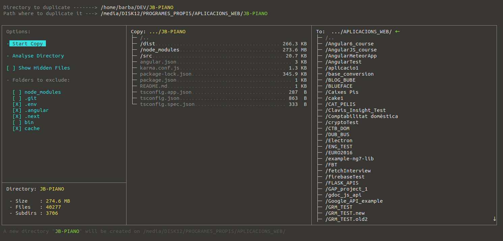
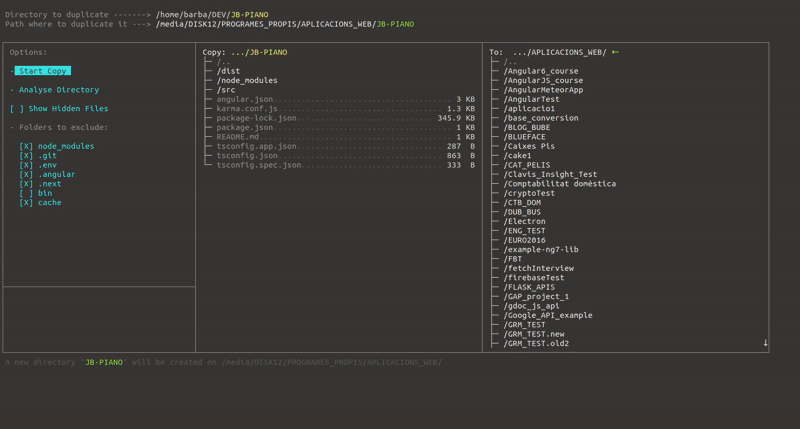
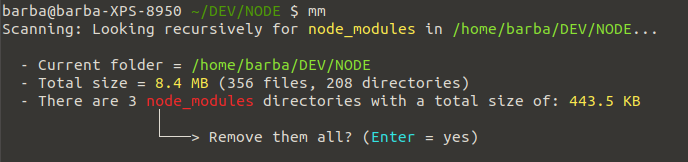

# JB-Copy

Node.js assisted **folder replication** on the terminal.<br/>

This runs the copy of a folder on another destination with assisted options.<br/>
You can skip some types of subfolders recursively, like `node_modules` or `.git`, so it doesn't make a full copy, ignoring those files not needed.<br/>

You can also use a navigation to select the **origin** and **destination**.




## Shortcut
It is recomended to use an alias (or shortcut) on your terminal, so you don't need to point to the source everytime you want to use it.<br/>
Example (`.bashrc` file):
```bash
alias copy="node /home/barba/DEV/NODE/copy.js"
alias mm="node /home/barba/DEV/NODE/remove_node_modules.js"
```


## Arguments
The program accepts 3 optional arguments:
- Param1 → Target folder to copy (the original folder to copy)
- Param2 → Base destination path where to copy
- Param3 → Options: `--run` means no terminal screen (automatically run the copy with the default options)

A new folder with the name of the **original folder** (Param1) will be created on "Param2" path.
If parameters 1 and 2 are not provided, the current path (cwd) is applied by default.

Example:
```bash
# With alias:
copy /home/barba/DEV/JB-PIANO /media/DISK12/PROGRAMES_PROPIS --run

# Without alias
node copy.js /home/barba/DEV/JB-PIANO /media/DISK12/PROGRAMES_PROPIS/
```
  
This will create a new folder ------> /media/DISK12/PROGRAMES_PROPIS/**JB-PIANO**  and copy `*.*` within.

## Interface

When you run the app (even with origin and destination parameters) a terminal screen shows up with 3 columns.

On the left column you can select the subfolders to be excluded on the copy (Select them and press "Enter" to check/uncheck them).<br/>

**Analyze Directory** → If you select this option (with Enter), a it runs full scan of the original folder, as it would do with the copy, to scan all the files and subfolders that will be copied, but no copy is done.
On the bottom you'll see the stats of the original folder that will be copied.



On the 2nd column you have the origin folder.<br/>
On the 3rd column you have the destination path.

You can navigate the columns with the left/right arrows.


# Remove Node Modules
An optional program is also provided to, instead of copy the folder, remove all **node_module** folders recursively from the current one.<br/>

It doesn't provide a full interface, but a quick prompt after a recursive folder scan, with some analitics:



There you can confirm to remove (with `rm -rf`) all `node_modules/` folders recursively.

